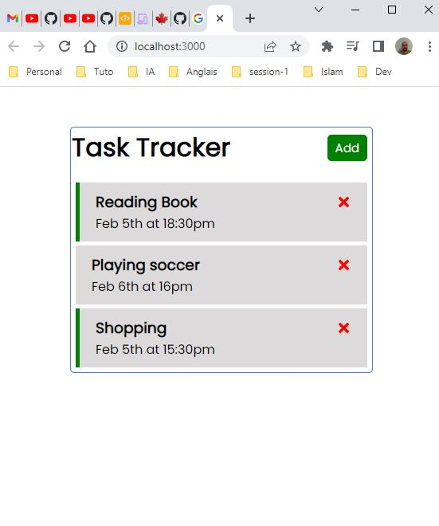
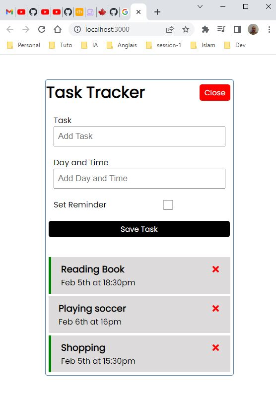

This project was bootstrapped with [Create React App](https://github.com/facebook/create-react-app).

## Available Scripts

In the project directory, you can run:

### `npm i json-server`
Install json-server 

### `npm run server`

Start the mock server (backend). 
Open [http://localhost:3004/tasks](http://localhost:3004/tasks) to get all users.

### `npm start`

Runs the app in the development mode. 
Open [http://localhost:3000](http://localhost:3000) to view it in the browser.

## Test Application

To display the list of users :

To add new Task
